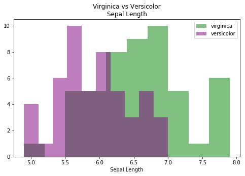
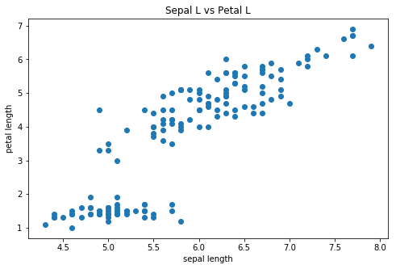

# Outline
* Questions
* Warm Up
* Load in Data
* Conduct Hypothesis Testing

# Questions
* what is an appropriate value or a pvalue? 
* what is the use of using pvalues?
* what is the `np.random.seed(N)`
    * replication within randomness

# Objectives
YWBAT
- conduct a 1 samp and 2 samp ttest using scipy.stats
- test for criteria of 1 sample and 2 sample ttests

# Warm Up

In a zoom chat, send an example of a type II error

### What is a pvalue?
* A probability that a data point would fall in to a set ASSUMING H0 IS TRUE.
* The probability of an event occurring given the null hypothesis is true.
* Pvalues change based on the problem
* There is a debate on the validity of using Pvalues...


```python
import pandas as pd
import numpy as np

import scipy.stats as scs
from sklearn.datasets import load_iris

import statsmodels.api as sm
import statsmodels.stats as stats

import matplotlib.pyplot as plt
import seaborn as sns
```


```python
iris = load_iris()
data = iris.data
target = iris.target
features = iris.feature_names
```


```python
df = pd.DataFrame(data, columns=features)
df['target'] = target
df.head()
```


<div>
<style scoped>
    .dataframe tbody tr th:only-of-type {
        vertical-align: middle;
    }

    .dataframe tbody tr th {
        vertical-align: top;
    }

    .dataframe thead th {
        text-align: right;
    }
</style>
<table border="1" class="dataframe">
  <thead>
    <tr style="text-align: right;">
      <th></th>
      <th>sepal length (cm)</th>
      <th>sepal width (cm)</th>
      <th>petal length (cm)</th>
      <th>petal width (cm)</th>
      <th>target</th>
    </tr>
  </thead>
  <tbody>
    <tr>
      <td>0</td>
      <td>5.1</td>
      <td>3.5</td>
      <td>1.4</td>
      <td>0.2</td>
      <td>0</td>
    </tr>
    <tr>
      <td>1</td>
      <td>4.9</td>
      <td>3.0</td>
      <td>1.4</td>
      <td>0.2</td>
      <td>0</td>
    </tr>
    <tr>
      <td>2</td>
      <td>4.7</td>
      <td>3.2</td>
      <td>1.3</td>
      <td>0.2</td>
      <td>0</td>
    </tr>
    <tr>
      <td>3</td>
      <td>4.6</td>
      <td>3.1</td>
      <td>1.5</td>
      <td>0.2</td>
      <td>0</td>
    </tr>
    <tr>
      <td>4</td>
      <td>5.0</td>
      <td>3.6</td>
      <td>1.4</td>
      <td>0.2</td>
      <td>0</td>
    </tr>
  </tbody>
</table>
</div>


```python
df['target_names'] = df['target'].apply(lambda x: iris.target_names[x])
```


```python
df.head()
```


<div>
<style scoped>
    .dataframe tbody tr th:only-of-type {
        vertical-align: middle;
    }

    .dataframe tbody tr th {
        vertical-align: top;
    }

    .dataframe thead th {
        text-align: right;
    }
</style>
<table border="1" class="dataframe">
  <thead>
    <tr style="text-align: right;">
      <th></th>
      <th>sepal length (cm)</th>
      <th>sepal width (cm)</th>
      <th>petal length (cm)</th>
      <th>petal width (cm)</th>
      <th>target</th>
      <th>target_names</th>
    </tr>
  </thead>
  <tbody>
    <tr>
      <td>0</td>
      <td>5.1</td>
      <td>3.5</td>
      <td>1.4</td>
      <td>0.2</td>
      <td>0</td>
      <td>setosa</td>
    </tr>
    <tr>
      <td>1</td>
      <td>4.9</td>
      <td>3.0</td>
      <td>1.4</td>
      <td>0.2</td>
      <td>0</td>
      <td>setosa</td>
    </tr>
    <tr>
      <td>2</td>
      <td>4.7</td>
      <td>3.2</td>
      <td>1.3</td>
      <td>0.2</td>
      <td>0</td>
      <td>setosa</td>
    </tr>
    <tr>
      <td>3</td>
      <td>4.6</td>
      <td>3.1</td>
      <td>1.5</td>
      <td>0.2</td>
      <td>0</td>
      <td>setosa</td>
    </tr>
    <tr>
      <td>4</td>
      <td>5.0</td>
      <td>3.6</td>
      <td>1.4</td>
      <td>0.2</td>
      <td>0</td>
      <td>setosa</td>
    </tr>
  </tbody>
</table>
</div>


```python
df.target_names.unique()
```


    array(['setosa', 'versicolor', 'virginica'], dtype=object)


```python
print(iris.DESCR)
```

    .. _iris_dataset:
    
    Iris plants dataset
    --------------------
    
    **Data Set Characteristics:**
    
        :Number of Instances: 150 (50 in each of three classes)
        :Number of Attributes: 4 numeric, predictive attributes and the class
        :Attribute Information:
            - sepal length in cm
            - sepal width in cm
            - petal length in cm
            - petal width in cm
            - class:
                    - Iris-Setosa
                    - Iris-Versicolour
                    - Iris-Virginica
                    
        :Summary Statistics:
    
        ============== ==== ==== ======= ===== ====================
                        Min  Max   Mean    SD   Class Correlation
        ============== ==== ==== ======= ===== ====================
        sepal length:   4.3  7.9   5.84   0.83    0.7826
        sepal width:    2.0  4.4   3.05   0.43   -0.4194
        petal length:   1.0  6.9   3.76   1.76    0.9490  (high!)
        petal width:    0.1  2.5   1.20   0.76    0.9565  (high!)
        ============== ==== ==== ======= ===== ====================
    
        :Missing Attribute Values: None
        :Class Distribution: 33.3% for each of 3 classes.
        :Creator: R.A. Fisher
        :Donor: Michael Marshall (MARSHALL%PLU@io.arc.nasa.gov)
        :Date: July, 1988
    
    The famous Iris database, first used by Sir R.A. Fisher. The dataset is taken
    from Fisher's paper. Note that it's the same as in R, but not as in the UCI
    Machine Learning Repository, which has two wrong data points.
    
    This is perhaps the best known database to be found in the
    pattern recognition literature.  Fisher's paper is a classic in the field and
    is referenced frequently to this day.  (See Duda & Hart, for example.)  The
    data set contains 3 classes of 50 instances each, where each class refers to a
    type of iris plant.  One class is linearly separable from the other 2; the
    latter are NOT linearly separable from each other.
    
    .. topic:: References
    
       - Fisher, R.A. "The use of multiple measurements in taxonomic problems"
         Annual Eugenics, 7, Part II, 179-188 (1936); also in "Contributions to
         Mathematical Statistics" (John Wiley, NY, 1950).
       - Duda, R.O., & Hart, P.E. (1973) Pattern Classification and Scene Analysis.
         (Q327.D83) John Wiley & Sons.  ISBN 0-471-22361-1.  See page 218.
       - Dasarathy, B.V. (1980) "Nosing Around the Neighborhood: A New System
         Structure and Classification Rule for Recognition in Partially Exposed
         Environments".  IEEE Transactions on Pattern Analysis and Machine
         Intelligence, Vol. PAMI-2, No. 1, 67-71.
       - Gates, G.W. (1972) "The Reduced Nearest Neighbor Rule".  IEEE Transactions
         on Information Theory, May 1972, 431-433.
       - See also: 1988 MLC Proceedings, 54-64.  Cheeseman et al"s AUTOCLASS II
         conceptual clustering system finds 3 classes in the data.
       - Many, many more ...


# Q1. Is the sepal length different between virginica and versicolor iris flowers?


```python
display(df.head(2))
display(df.tail(2))
```


<div>
<style scoped>
    .dataframe tbody tr th:only-of-type {
        vertical-align: middle;
    }

    .dataframe tbody tr th {
        vertical-align: top;
    }

    .dataframe thead th {
        text-align: right;
    }
</style>
<table border="1" class="dataframe">
  <thead>
    <tr style="text-align: right;">
      <th></th>
      <th>sepal length (cm)</th>
      <th>sepal width (cm)</th>
      <th>petal length (cm)</th>
      <th>petal width (cm)</th>
      <th>target</th>
      <th>target_names</th>
    </tr>
  </thead>
  <tbody>
    <tr>
      <td>0</td>
      <td>5.1</td>
      <td>3.5</td>
      <td>1.4</td>
      <td>0.2</td>
      <td>0</td>
      <td>setosa</td>
    </tr>
    <tr>
      <td>1</td>
      <td>4.9</td>
      <td>3.0</td>
      <td>1.4</td>
      <td>0.2</td>
      <td>0</td>
      <td>setosa</td>
    </tr>
  </tbody>
</table>
</div>


<div>
<style scoped>
    .dataframe tbody tr th:only-of-type {
        vertical-align: middle;
    }

    .dataframe tbody tr th {
        vertical-align: top;
    }

    .dataframe thead th {
        text-align: right;
    }
</style>
<table border="1" class="dataframe">
  <thead>
    <tr style="text-align: right;">
      <th></th>
      <th>sepal length (cm)</th>
      <th>sepal width (cm)</th>
      <th>petal length (cm)</th>
      <th>petal width (cm)</th>
      <th>target</th>
      <th>target_names</th>
    </tr>
  </thead>
  <tbody>
    <tr>
      <td>148</td>
      <td>6.2</td>
      <td>3.4</td>
      <td>5.4</td>
      <td>2.3</td>
      <td>2</td>
      <td>virginica</td>
    </tr>
    <tr>
      <td>149</td>
      <td>5.9</td>
      <td>3.0</td>
      <td>5.1</td>
      <td>1.8</td>
      <td>2</td>
      <td>virginica</td>
    </tr>
  </tbody>
</table>
</div>


```python
sl_virginica = df["sepal length (cm)"][df["target_names"] == "virginica"]
```


```python
sl_virginica[:5]
```


    100    6.3
    101    5.8
    102    7.1
    103    6.3
    104    6.5
    Name: sepal length (cm), dtype: float64


```python
sl_versicolor = df[df['target_names']=='versicolor']['sepal length (cm)']
sl_versicolor[:5]
```


    50    7.0
    51    6.4
    52    6.9
    53    5.5
    54    6.5
    Name: sepal length (cm), dtype: float64


```python
plt.figure(figsize=(8, 5))
plt.hist(sl_virginica, label='virginica', color='green', alpha=0.5)
plt.hist(sl_versicolor, label='versicolor', color='purple', alpha=0.5)
plt.title("Virginica vs Versicolor\nSepal Length")
plt.xlabel("Sepal Length")
plt.legend()
plt.show()
```





# INSIGHTS
* distributions look normal
* they look skewed
* the means of the distributions should be different


```python
# So, because we have 2 samples of data we use a 2 sample ttest
# What are the assumptions?
# both distributions are normal
# equal variance for student ttest, otherwise welch's ttest
```

# Tests for normality - Shapiro


```python
# H0: data is normal (alpha=0.95)
# HA: data is not normal

scs.shapiro(sl_virginica), scs.shapiro(sl_versicolor)
# p = 0.25 > 0.05 -> data is normal
# p = 0.46 > 0.05 -> data is normal
```


    ((0.9711798429489136, 0.25832483172416687),
     (0.9778355956077576, 0.46473264694213867))


Our data is normal! 

# Now test for equal variances - Levene
(we don't really need to do this, because Welch's ttest is awesome)


```python
# H0: var1 = var2
# HA: var1 != var2

scs.levene(sl_versicolor, sl_virginica)
# pvalue = 0.3 -> variances are equal
```


    LeveneResult(statistic=1.024522457408365, pvalue=0.3139412235249392)


# Now that our assumptions are met, we can run a ttest

### H0: mu_versicolor = mu_virginica
### HA: mu_versicolor $\neq$ mu_virginica


```python
# H0: mu_versicolor = mu_virginica
# HA: mu_versicolor != mu_virginica


# student ttest, welch's ttest
scs.ttest_ind(sl_versicolor, sl_virginica), scs.ttest_ind(sl_versicolor, sl_virginica, equal_var=False)

# p = 0.0 -> reject the null -> the means are different
```


    (Ttest_indResult(statistic=-5.629165259719801, pvalue=1.7248563024547942e-07),
     Ttest_indResult(statistic=-5.629165259719801, pvalue=1.8661443873771216e-07))


```python
X = df['sepal length (cm)'].values
y = df['petal length (cm)'].values
X, y
```


    (array([5.1, 4.9, 4.7, 4.6, 5. , 5.4, 4.6, 5. , 4.4, 4.9, 5.4, 4.8, 4.8,
            4.3, 5.8, 5.7, 5.4, 5.1, 5.7, 5.1, 5.4, 5.1, 4.6, 5.1, 4.8, 5. ,
            5. , 5.2, 5.2, 4.7, 4.8, 5.4, 5.2, 5.5, 4.9, 5. , 5.5, 4.9, 4.4,
            5.1, 5. , 4.5, 4.4, 5. , 5.1, 4.8, 5.1, 4.6, 5.3, 5. , 7. , 6.4,
            6.9, 5.5, 6.5, 5.7, 6.3, 4.9, 6.6, 5.2, 5. , 5.9, 6. , 6.1, 5.6,
            6.7, 5.6, 5.8, 6.2, 5.6, 5.9, 6.1, 6.3, 6.1, 6.4, 6.6, 6.8, 6.7,
            6. , 5.7, 5.5, 5.5, 5.8, 6. , 5.4, 6. , 6.7, 6.3, 5.6, 5.5, 5.5,
            6.1, 5.8, 5. , 5.6, 5.7, 5.7, 6.2, 5.1, 5.7, 6.3, 5.8, 7.1, 6.3,
            6.5, 7.6, 4.9, 7.3, 6.7, 7.2, 6.5, 6.4, 6.8, 5.7, 5.8, 6.4, 6.5,
            7.7, 7.7, 6. , 6.9, 5.6, 7.7, 6.3, 6.7, 7.2, 6.2, 6.1, 6.4, 7.2,
            7.4, 7.9, 6.4, 6.3, 6.1, 7.7, 6.3, 6.4, 6. , 6.9, 6.7, 6.9, 5.8,
            6.8, 6.7, 6.7, 6.3, 6.5, 6.2, 5.9]),
     array([1.4, 1.4, 1.3, 1.5, 1.4, 1.7, 1.4, 1.5, 1.4, 1.5, 1.5, 1.6, 1.4,
            1.1, 1.2, 1.5, 1.3, 1.4, 1.7, 1.5, 1.7, 1.5, 1. , 1.7, 1.9, 1.6,
            1.6, 1.5, 1.4, 1.6, 1.6, 1.5, 1.5, 1.4, 1.5, 1.2, 1.3, 1.4, 1.3,
            1.5, 1.3, 1.3, 1.3, 1.6, 1.9, 1.4, 1.6, 1.4, 1.5, 1.4, 4.7, 4.5,
            4.9, 4. , 4.6, 4.5, 4.7, 3.3, 4.6, 3.9, 3.5, 4.2, 4. , 4.7, 3.6,
            4.4, 4.5, 4.1, 4.5, 3.9, 4.8, 4. , 4.9, 4.7, 4.3, 4.4, 4.8, 5. ,
            4.5, 3.5, 3.8, 3.7, 3.9, 5.1, 4.5, 4.5, 4.7, 4.4, 4.1, 4. , 4.4,
            4.6, 4. , 3.3, 4.2, 4.2, 4.2, 4.3, 3. , 4.1, 6. , 5.1, 5.9, 5.6,
            5.8, 6.6, 4.5, 6.3, 5.8, 6.1, 5.1, 5.3, 5.5, 5. , 5.1, 5.3, 5.5,
            6.7, 6.9, 5. , 5.7, 4.9, 6.7, 4.9, 5.7, 6. , 4.8, 4.9, 5.6, 5.8,
            6.1, 6.4, 5.6, 5.1, 5.6, 6.1, 5.6, 5.5, 4.8, 5.4, 5.6, 5.1, 5.1,
            5.9, 5.7, 5.2, 5. , 5.2, 5.4, 5.1]))


```python
plt.figure(figsize=(8, 5))
plt.scatter(X, y)
plt.title("Sepal L vs Petal L")
plt.xlabel("sepal length")
plt.ylabel("petal length")
plt.show()
```





```python
linreg = sm.OLS(y, X)
results = linreg.fit()
results.summary()
```


<table class="simpletable">
<caption>OLS Regression Results</caption>
<tr>
  <th>Dep. Variable:</th>            <td>y</td>        <th>  R-squared (uncentered):</th>      <td>   0.900</td>
</tr>
<tr>
  <th>Model:</th>                   <td>OLS</td>       <th>  Adj. R-squared (uncentered):</th> <td>   0.899</td>
</tr>
<tr>
  <th>Method:</th>             <td>Least Squares</td>  <th>  F-statistic:       </th>          <td>   1334.</td>
</tr>
<tr>
  <th>Date:</th>             <td>Tue, 28 Jan 2020</td> <th>  Prob (F-statistic):</th>          <td>3.02e-76</td>
</tr>
<tr>
  <th>Time:</th>                 <td>14:51:30</td>     <th>  Log-Likelihood:    </th>          <td> -253.92</td>
</tr>
<tr>
  <th>No. Observations:</th>      <td>   150</td>      <th>  AIC:               </th>          <td>   509.8</td>
</tr>
<tr>
  <th>Df Residuals:</th>          <td>   149</td>      <th>  BIC:               </th>          <td>   512.9</td>
</tr>
<tr>
  <th>Df Model:</th>              <td>     1</td>      <th>                     </th>              <td> </td>   
</tr>
<tr>
  <th>Covariance Type:</th>      <td>nonrobust</td>    <th>                     </th>              <td> </td>   
</tr>
</table>
<table class="simpletable">
<tr>
   <td></td>     <th>coef</th>     <th>std err</th>      <th>t</th>      <th>P>|t|</th>  <th>[0.025</th>    <th>0.975]</th>  
</tr>
<tr>
  <th>x1</th> <td>    0.6669</td> <td>    0.018</td> <td>   36.530</td> <td> 0.000</td> <td>    0.631</td> <td>    0.703</td>
</tr>
</table>
<table class="simpletable">
<tr>
  <th>Omnibus:</th>       <td>210.387</td> <th>  Durbin-Watson:     </th> <td>   0.101</td>
</tr>
<tr>
  <th>Prob(Omnibus):</th> <td> 0.000</td>  <th>  Jarque-Bera (JB):  </th> <td>  16.638</td>
</tr>
<tr>
  <th>Skew:</th>          <td>-0.429</td>  <th>  Prob(JB):          </th> <td>0.000244</td>
</tr>
<tr>
  <th>Kurtosis:</th>      <td> 1.612</td>  <th>  Cond. No.          </th> <td>    1.00</td>
</tr>
</table><br/><br/>Warnings:<br/>[1] Standard Errors assume that the covariance matrix of the errors is correctly specified.


```python
mc = stats.multicomp.MultiComparison(df['sepal length (cm)'], df['target_names'])
```


```python
res = mc.tukeyhsd()
print(res)
```

       Multiple Comparison of Means - Tukey HSD, FWER=0.05   
    =========================================================
      group1     group2   meandiff p-adj lower  upper  reject
    ---------------------------------------------------------
        setosa versicolor     0.93 0.001 0.6862 1.1738   True
        setosa  virginica    1.582 0.001 1.3382 1.8258   True
    versicolor  virginica    0.652 0.001 0.4082 0.8958   True
    ---------------------------------------------------------


```python
for col in df.columns[:4]:
    mc = stats.multicomp.MultiComparison(df[col], df['target_names'])
    print(f"Testing: {col}")
    res = mc.tukeyhsd()
    print(res)
    print("\n\n")
```

    Testing: sepal length (cm)
       Multiple Comparison of Means - Tukey HSD, FWER=0.05   
    =========================================================
      group1     group2   meandiff p-adj lower  upper  reject
    ---------------------------------------------------------
        setosa versicolor     0.93 0.001 0.6862 1.1738   True
        setosa  virginica    1.582 0.001 1.3382 1.8258   True
    versicolor  virginica    0.652 0.001 0.4082 0.8958   True
    ---------------------------------------------------------
    
    
    
    Testing: sepal width (cm)
        Multiple Comparison of Means - Tukey HSD, FWER=0.05     
    ============================================================
      group1     group2   meandiff p-adj   lower   upper  reject
    ------------------------------------------------------------
        setosa versicolor   -0.658  0.001 -0.8189 -0.4971   True
        setosa  virginica   -0.454  0.001 -0.6149 -0.2931   True
    versicolor  virginica    0.204 0.0088  0.0431  0.3649   True
    ------------------------------------------------------------
    
    
    
    Testing: petal length (cm)
       Multiple Comparison of Means - Tukey HSD, FWER=0.05   
    =========================================================
      group1     group2   meandiff p-adj lower  upper  reject
    ---------------------------------------------------------
        setosa versicolor    2.798 0.001 2.5942 3.0018   True
        setosa  virginica     4.09 0.001 3.8862 4.2938   True
    versicolor  virginica    1.292 0.001 1.0882 1.4958   True
    ---------------------------------------------------------
    
    
    
    Testing: petal width (cm)
       Multiple Comparison of Means - Tukey HSD, FWER=0.05   
    =========================================================
      group1     group2   meandiff p-adj lower  upper  reject
    ---------------------------------------------------------
        setosa versicolor     1.08 0.001 0.9831 1.1769   True
        setosa  virginica     1.78 0.001 1.6831 1.8769   True
    versicolor  virginica      0.7 0.001 0.6031 0.7969   True
    ---------------------------------------------------------
    
    
    


# What did we learn today?
- how np.random.seed() works
- alpha values aren't always the same
- p values are a big deal
- a lot of smart people have built great EDA tools for us
- how to check datasets for normality
- before running a ttest you must test the assumptions
    - must check for normality
    - must check for equal variances
- how to run a ttest
- use a levene test to compare variances
- shapiro test to check normality
- conversion of pandas series to a numpy array


```python

```
