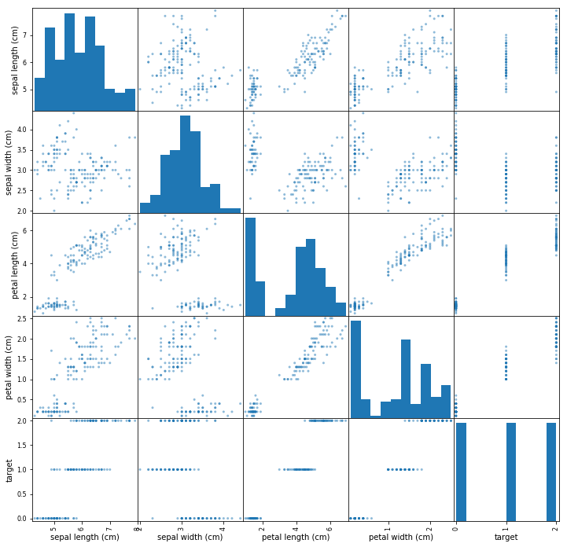
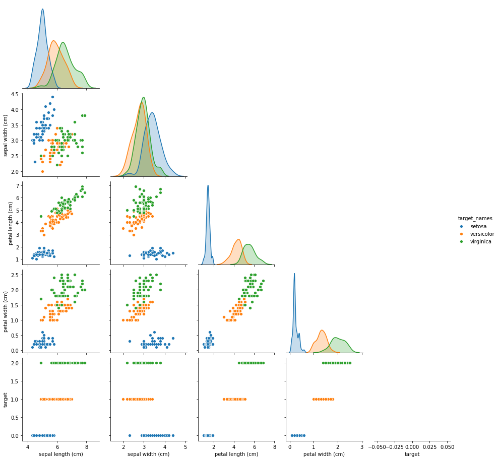
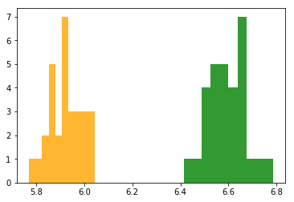

# Outline
* Questions
* Warm Up
* Load in Data
* Conduct Hypothesis Testing

# Objectives
YWBAT
- conduct a 1 samp and 2 samp ttest using scipy.stats
- test for criteria of 1 sample and 2 sample ttests

# Warm Up

In a zoom chat, send an example of a type II error

### What is a pvalue?
* A probability that a data point would fall in to a set ASSUMING H0 IS TRUE.
* The probability of an event occurring given the null hypothesis is true.
* Pvalues change based on the problem
* There is a debate on the validity of using Pvalues...


```python
import pandas as pd
import numpy as np

import scipy.stats as scs
from sklearn.datasets import load_iris

import statsmodels.api as sm
import statsmodels.stats as stats

import matplotlib.pyplot as plt
import seaborn as sns
```


```python
iris = load_iris()
data = iris.data
target = iris.target
features = iris.feature_names
```


```python
df = pd.DataFrame(data, columns=features)
df['target'] = target
df.head()
```


<div>
<style scoped>
    .dataframe tbody tr th:only-of-type {
        vertical-align: middle;
    }

    .dataframe tbody tr th {
        vertical-align: top;
    }

    .dataframe thead th {
        text-align: right;
    }
</style>
<table border="1" class="dataframe">
  <thead>
    <tr style="text-align: right;">
      <th></th>
      <th>sepal length (cm)</th>
      <th>sepal width (cm)</th>
      <th>petal length (cm)</th>
      <th>petal width (cm)</th>
      <th>target</th>
    </tr>
  </thead>
  <tbody>
    <tr>
      <td>0</td>
      <td>5.1</td>
      <td>3.5</td>
      <td>1.4</td>
      <td>0.2</td>
      <td>0</td>
    </tr>
    <tr>
      <td>1</td>
      <td>4.9</td>
      <td>3.0</td>
      <td>1.4</td>
      <td>0.2</td>
      <td>0</td>
    </tr>
    <tr>
      <td>2</td>
      <td>4.7</td>
      <td>3.2</td>
      <td>1.3</td>
      <td>0.2</td>
      <td>0</td>
    </tr>
    <tr>
      <td>3</td>
      <td>4.6</td>
      <td>3.1</td>
      <td>1.5</td>
      <td>0.2</td>
      <td>0</td>
    </tr>
    <tr>
      <td>4</td>
      <td>5.0</td>
      <td>3.6</td>
      <td>1.4</td>
      <td>0.2</td>
      <td>0</td>
    </tr>
  </tbody>
</table>
</div>


```python
df['target_names'] = df['target'].apply(lambda x: iris.target_names[x])
```


```python
df.head()
```


<div>
<style scoped>
    .dataframe tbody tr th:only-of-type {
        vertical-align: middle;
    }

    .dataframe tbody tr th {
        vertical-align: top;
    }

    .dataframe thead th {
        text-align: right;
    }
</style>
<table border="1" class="dataframe">
  <thead>
    <tr style="text-align: right;">
      <th></th>
      <th>sepal length (cm)</th>
      <th>sepal width (cm)</th>
      <th>petal length (cm)</th>
      <th>petal width (cm)</th>
      <th>target</th>
      <th>target_names</th>
    </tr>
  </thead>
  <tbody>
    <tr>
      <td>0</td>
      <td>5.1</td>
      <td>3.5</td>
      <td>1.4</td>
      <td>0.2</td>
      <td>0</td>
      <td>setosa</td>
    </tr>
    <tr>
      <td>1</td>
      <td>4.9</td>
      <td>3.0</td>
      <td>1.4</td>
      <td>0.2</td>
      <td>0</td>
      <td>setosa</td>
    </tr>
    <tr>
      <td>2</td>
      <td>4.7</td>
      <td>3.2</td>
      <td>1.3</td>
      <td>0.2</td>
      <td>0</td>
      <td>setosa</td>
    </tr>
    <tr>
      <td>3</td>
      <td>4.6</td>
      <td>3.1</td>
      <td>1.5</td>
      <td>0.2</td>
      <td>0</td>
      <td>setosa</td>
    </tr>
    <tr>
      <td>4</td>
      <td>5.0</td>
      <td>3.6</td>
      <td>1.4</td>
      <td>0.2</td>
      <td>0</td>
      <td>setosa</td>
    </tr>
  </tbody>
</table>
</div>


```python
df.target_names.unique()
```


    array(['setosa', 'versicolor', 'virginica'], dtype=object)


```python
print(iris.DESCR)
```

    .. _iris_dataset:
    
    Iris plants dataset
    --------------------
    
    **Data Set Characteristics:**
    
        :Number of Instances: 150 (50 in each of three classes)
        :Number of Attributes: 4 numeric, predictive attributes and the class
        :Attribute Information:
            - sepal length in cm
            - sepal width in cm
            - petal length in cm
            - petal width in cm
            - class:
                    - Iris-Setosa
                    - Iris-Versicolour
                    - Iris-Virginica
                    
        :Summary Statistics:
    
        ============== ==== ==== ======= ===== ====================
                        Min  Max   Mean    SD   Class Correlation
        ============== ==== ==== ======= ===== ====================
        sepal length:   4.3  7.9   5.84   0.83    0.7826
        sepal width:    2.0  4.4   3.05   0.43   -0.4194
        petal length:   1.0  6.9   3.76   1.76    0.9490  (high!)
        petal width:    0.1  2.5   1.20   0.76    0.9565  (high!)
        ============== ==== ==== ======= ===== ====================
    
        :Missing Attribute Values: None
        :Class Distribution: 33.3% for each of 3 classes.
        :Creator: R.A. Fisher
        :Donor: Michael Marshall (MARSHALL%PLU@io.arc.nasa.gov)
        :Date: July, 1988
    
    The famous Iris database, first used by Sir R.A. Fisher. The dataset is taken
    from Fisher's paper. Note that it's the same as in R, but not as in the UCI
    Machine Learning Repository, which has two wrong data points.
    
    This is perhaps the best known database to be found in the
    pattern recognition literature.  Fisher's paper is a classic in the field and
    is referenced frequently to this day.  (See Duda & Hart, for example.)  The
    data set contains 3 classes of 50 instances each, where each class refers to a
    type of iris plant.  One class is linearly separable from the other 2; the
    latter are NOT linearly separable from each other.
    
    .. topic:: References
    
       - Fisher, R.A. "The use of multiple measurements in taxonomic problems"
         Annual Eugenics, 7, Part II, 179-188 (1936); also in "Contributions to
         Mathematical Statistics" (John Wiley, NY, 1950).
       - Duda, R.O., & Hart, P.E. (1973) Pattern Classification and Scene Analysis.
         (Q327.D83) John Wiley & Sons.  ISBN 0-471-22361-1.  See page 218.
       - Dasarathy, B.V. (1980) "Nosing Around the Neighborhood: A New System
         Structure and Classification Rule for Recognition in Partially Exposed
         Environments".  IEEE Transactions on Pattern Analysis and Machine
         Intelligence, Vol. PAMI-2, No. 1, 67-71.
       - Gates, G.W. (1972) "The Reduced Nearest Neighbor Rule".  IEEE Transactions
         on Information Theory, May 1972, 431-433.
       - See also: 1988 MLC Proceedings, 54-64.  Cheeseman et al"s AUTOCLASS II
         conceptual clustering system finds 3 classes in the data.
       - Many, many more ...


```python
df.head()
```


<div>
<style scoped>
    .dataframe tbody tr th:only-of-type {
        vertical-align: middle;
    }

    .dataframe tbody tr th {
        vertical-align: top;
    }

    .dataframe thead th {
        text-align: right;
    }
</style>
<table border="1" class="dataframe">
  <thead>
    <tr style="text-align: right;">
      <th></th>
      <th>sepal length (cm)</th>
      <th>sepal width (cm)</th>
      <th>petal length (cm)</th>
      <th>petal width (cm)</th>
      <th>target</th>
      <th>target_names</th>
    </tr>
  </thead>
  <tbody>
    <tr>
      <td>0</td>
      <td>5.1</td>
      <td>3.5</td>
      <td>1.4</td>
      <td>0.2</td>
      <td>0</td>
      <td>setosa</td>
    </tr>
    <tr>
      <td>1</td>
      <td>4.9</td>
      <td>3.0</td>
      <td>1.4</td>
      <td>0.2</td>
      <td>0</td>
      <td>setosa</td>
    </tr>
    <tr>
      <td>2</td>
      <td>4.7</td>
      <td>3.2</td>
      <td>1.3</td>
      <td>0.2</td>
      <td>0</td>
      <td>setosa</td>
    </tr>
    <tr>
      <td>3</td>
      <td>4.6</td>
      <td>3.1</td>
      <td>1.5</td>
      <td>0.2</td>
      <td>0</td>
      <td>setosa</td>
    </tr>
    <tr>
      <td>4</td>
      <td>5.0</td>
      <td>3.6</td>
      <td>1.4</td>
      <td>0.2</td>
      <td>0</td>
      <td>setosa</td>
    </tr>
  </tbody>
</table>
</div>


```python
# pandas scattermatrix
pd.plotting.scatter_matrix(df, figsize=(12, 12))
plt.show()
```





```python
sns.pairplot(df, hue='target_names', corner=True)
plt.show()
```





# Q1. Is the mean sepal length different between virginica and versicolor iris flowers?

* get data
* ensure it's normal
* take sampling statistics to compare the mean
* run levene and shapiro tests
* calculate cohen's d 
* write up findings


```python
sl_virg = df.loc[df['target_names']=='virginica', 'sepal length (cm)']
sl_vers = df.loc[df['target_names']=='versicolor', 'sepal length (cm)']
```

## what kind of test do we need to compare 2 populations? 
* 2 sample ttest

## what are the assumptions of a 2 sample ttest?
* data is continuous - yes
* data follows normal distribution - we need to test
* variances are equal (otherwise you have to run a different ttest) - we need to test
* independent - yes
* sample things correctly and randomly - yes


## what is the null and alternative hypothesis of a 2 sample ttest
* H0: $\mu_\text{virginica} = \mu_\text{versicolor}$
* HA: $\mu_\text{virginica} \neq \mu_\text{versicolor}$

* H0: mu_virginica = mu_versicolor
* HA: mu_virginica != mu_versicolor


# step 1: test for normality


```python
sl_virg.shape, sl_vers.shape
```


    ((50,), (50,))


```python
# if i'm testing the means, I don't care about the populations
# what should I be taking
sample_mus_virginica = []
sample_mus_versicolor = []
for i in range(30):
    virgSamp = np.random.choice(sl_virg, size=50, replace=True).mean()
    versSamp = np.random.choice(sl_vers, size=50, replace=True).mean()
    sample_mus_virginica.append(virgSamp)
    sample_mus_versicolor.append(versSamp)
```


```python
# test each sample for normality using shapiro
# h0: data was drawn from a normal distribution 
# ha: data was not drawn from a normal distribution
# if p<0.05 reject the null otherwise
# p >= 0.05 fail to reject the null
t1, p1 = scs.shapiro(sample_mus_virginica)
t2, p2 = scs.shapiro(sample_mus_versicolor)

print(p1)
print(p2)

# since p > 0.05 in both cases we fail to reject that the data is normal
# therefore we can assume that our data is normal
```

    0.2866269648075104
    0.3906897008419037


```python
# test for equal variances using a levene test
# h0: samples are from populations with equal variances
# ha: samples are not from populations with equal variances

t, p = scs.levene(sample_mus_virginica, sample_mus_versicolor)
p
# since p>0.05 we fail to reject that the variances are equal
# therefore we can assume that our variances are equal
```


    0.7144632773343726


```python
# Now that our assumptions are met we can actually do a ttest
```


```python
# h0: mu_virginica = mu_versicolor
# ha: mu_virginica != mu_versicolor
t, p = scs.ttest_ind(sample_mus_virginica, sample_mus_versicolor, equal_var=False)
p
```


    3.576429102305599e-42


## Initial Findings
After doing a sampling distribution of the mean and running a welch's ttest one can conclude that the mean sample length of each group is different. 

## Next Steps: Now let's measure how different these means are


```python
# how do we measure difference of means? 
# power analysis
```


```python
def cohen_d(x,y):
    nx = len(x)
    ny = len(y)
    dof = nx + ny - 2
    return np.abs(np.mean(x) - np.mean(y)) / np.sqrt(((nx-1)*np.std(x, ddof=1) ** 2 + (ny-1)*np.std(y, ddof=1) ** 2) / dof)

```


```python
effect_size = cohen_d(sample_mus_virginica, sample_mus_versicolor)
effect_size
```


    9.646166197224769


```python
from statsmodels.stats.power import TTestIndPower
```


```python
analysis = TTestIndPower()
```


```python
result = analysis.solve_power(effect_size=effect_size, nobs1=30, alpha=0.05)
result
```


    1.0


```python
type2error_rate = 1 - result
type2error_rate
```


    0.0


# How do we interpret this? 
if you take a sample of versicolors or virginicas and measure the mean sepal length I can tell you with 100% certainity where the flowers came from.


```python
plt.hist(sample_mus_virginica, color='green', alpha=0.8)
plt.hist(sample_mus_versicolor, color='orange', alpha=0.8)
plt.show()
```





# Q2 Is the petal length different among any of the iris flowers (anova)


```python

```


```python

```


```python

```

# Comparing multiple groups


```python
mc = stats.multicomp.MultiComparison(df['sepal length (cm)'], df['target_names'])
```


```python
res = mc.tukeyhsd()
print(res)
```

       Multiple Comparison of Means - Tukey HSD, FWER=0.05   
    =========================================================
      group1     group2   meandiff p-adj lower  upper  reject
    ---------------------------------------------------------
        setosa versicolor     0.93 0.001 0.6862 1.1738   True
        setosa  virginica    1.582 0.001 1.3382 1.8258   True
    versicolor  virginica    0.652 0.001 0.4082 0.8958   True
    ---------------------------------------------------------


```python
for col in df.columns[:4]:
    mc = stats.multicomp.MultiComparison(df[col], df['target_names'])
    print(f"Testing: {col}")
    res = mc.tukeyhsd()
    print(res)
    print("\n\n")
```

    Testing: sepal length (cm)
       Multiple Comparison of Means - Tukey HSD, FWER=0.05   
    =========================================================
      group1     group2   meandiff p-adj lower  upper  reject
    ---------------------------------------------------------
        setosa versicolor     0.93 0.001 0.6862 1.1738   True
        setosa  virginica    1.582 0.001 1.3382 1.8258   True
    versicolor  virginica    0.652 0.001 0.4082 0.8958   True
    ---------------------------------------------------------
    
    
    
    Testing: sepal width (cm)
        Multiple Comparison of Means - Tukey HSD, FWER=0.05     
    ============================================================
      group1     group2   meandiff p-adj   lower   upper  reject
    ------------------------------------------------------------
        setosa versicolor   -0.658  0.001 -0.8189 -0.4971   True
        setosa  virginica   -0.454  0.001 -0.6149 -0.2931   True
    versicolor  virginica    0.204 0.0088  0.0431  0.3649   True
    ------------------------------------------------------------
    
    
    
    Testing: petal length (cm)
       Multiple Comparison of Means - Tukey HSD, FWER=0.05   
    =========================================================
      group1     group2   meandiff p-adj lower  upper  reject
    ---------------------------------------------------------
        setosa versicolor    2.798 0.001 2.5942 3.0018   True
        setosa  virginica     4.09 0.001 3.8862 4.2938   True
    versicolor  virginica    1.292 0.001 1.0882 1.4958   True
    ---------------------------------------------------------
    
    
    
    Testing: petal width (cm)
       Multiple Comparison of Means - Tukey HSD, FWER=0.05   
    =========================================================
      group1     group2   meandiff p-adj lower  upper  reject
    ---------------------------------------------------------
        setosa versicolor     1.08 0.001 0.9831 1.1769   True
        setosa  virginica     1.78 0.001 1.6831 1.8769   True
    versicolor  virginica      0.7 0.001 0.6031 0.7969   True
    ---------------------------------------------------------
    
    
    


# What did we learn today?
* don't only eyeball normality
* shapiro and levene test
* pairplots are awesome and very useful for data viz
* power analysis
    * you'll always have 3 of 4 and it will always solve for the 4th
* input into the scatter matrix 
* cohen's d to measure the effect size 
* alpha=0.05 because it's standard


```python

```
